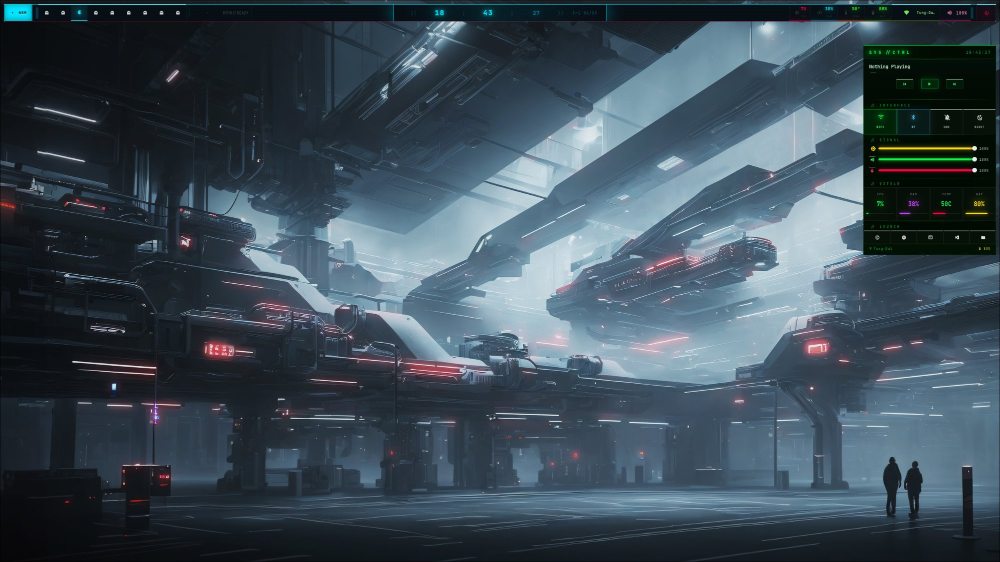

k<div align="center">

```
███╗   ██╗ ██████╗    ██████╗  ██████╗ ███████╗███████╗
████╗  ██║██╔════╝   ╚════██╗██╔═████╗╚════██╔╝╚════██╗
██╔██╗ ██║██║         █████╔╝██║██╔██║    ██╔╝     ██╔╝
██║╚██╗██║██║        ██╔═══╝ ████╔╝██║   ██╔╝     ██╔╝
██║ ╚████║╚██████╗██╗███████╗╚██████╔╝   ██║      ██║
╚═╝  ╚═══╝ ╚═════╝╚═╝╚══════╝ ╚═════╝   ╚═╝      ╚═╝
```

**Cyberpunk 2077 × Arch Linux × Hyprland**

*Handcrafted dotfiles — built for performance, aesthetics, and zero bloat.*

[](https://archlinux.org)
[](https://hyprland.org)
[](https://github.com/elkowar/eww)
[](https://github.com/vuphitung/CyberDotfiles/stargazers)

</div>

---

## ◈ Preview



> **Top bar** — floating cyan neon strip · workspace indicators · system stats · clock  
> **SYS // CTRL** (top-right) — media player · wifi/bt/dnd/night toggles · sliders · vitals · launcher

---

## ◈ Stack

| Role | Tool |
|------|------|
| Compositor | [Hyprland](https://hyprland.org) |
| Bar + Control Center | [EWW](https://github.com/elkowar/eww) |
| Terminal | [Kitty](https://sw.kovidgoyal.net/kitty) |
| Launcher | [Rofi](https://github.com/davatorium/rofi) |
| Wallpaper | [swww](https://github.com/LGFae/swww) + [pywal](https://github.com/dylanaraps/pywal) |
| Logout | [wlogout](https://github.com/ArtsyMacaw/wlogout) |
| Notifications | [swaync](https://github.com/ErikReider/SwayNotificationCenter) |
| Audio | pamixer + pipewire |
| Screenshot | grimblast |
| Night mode | gammastep |

---

## ◈ Features

```
◆ Floating bar        10px margins · cyan neon top border · red accent bottom
◆ Control Center      SYS // CTRL — media, toggles, sliders, vitals, app launcher
◆ Zero-poll bar       Socket-driven workspaces + window title via Hyprland IPC
◆ Optimized hub       Staggered poll intervals 3s/5s/12s/15s — total <2% CPU
◆ WiFi fix            iwlwifi power_save=0 — no more random disconnects
◆ CyberGuard          Background CPU watchdog with desktop notifications
◆ One-command setup   Packages · symlinks · wifi fix · wallpaper · health check
```

---

## ◈ Quick Install

> **Requirements:** Arch Linux · Hyprland working · `git` · `yay` (AUR helper)

```bash
git clone https://github.com/vuphitung/CyberDotfiles.git ~/CyberDotfiles
cd ~/CyberDotfiles
bash install.sh
```

After install:
```bash
hyprctl reload
bash ~/CyberDotfiles/config/eww/scripts/launch-bar.sh
```

---

## ◈ File Structure

```
CyberDotfiles/
├── install.sh                     ← Run this first
├── config/
│   ├── hypr/hyprland.conf         Keybinds · animations · window rules
│   ├── eww/
│   │   ├── eww.yuck               Widget layout
│   │   ├── eww.css                Cyberpunk 2077 styling
│   │   └── scripts/
│   │       ├── hub.sh             System data collector
│   │       ├── action.sh          Toggle actions (wifi/bt/dnd/night/media)
│   │       ├── launch-bar.sh      Start the bar
│   │       ├── toggle-bar.sh      Hide/show bar — Win+B
│   │       ├── wintitle.sh        Active window title (socket-driven)
│   │       └── workspaces.sh      Workspace tracker (socket-driven)
│   ├── kitty/                     Terminal config
│   ├── rofi/                      Launcher theme
│   └── wlogout/                   Logout menu
└── scripts/
    ├── cyberguard.sh              CPU spike watchdog
    ├── wallpaper.sh               Random wallpaper + pywal colors
    ├── keyhints.sh                Keybind browser (Rofi)
    ├── iwlwifi-fix.sh             Intel WiFi stability fix
    ├── setup_all.sh               System auditor
    └── check_health.py            Health checker
```

---

## ◈ Keybinds

| Key | Action |
|-----|--------|
| `Win + Enter` | Terminal (Kitty) |
| `Win + Space` | App launcher (Rofi) |
| `Win + B` | Toggle bar |
| `Win + Q` | Close window |
| `Win + F` | Fullscreen |
| `Win + V` | Float window |
| `Win + [1–9]` | Switch workspace |
| `Win + Shift + [1–9]` | Move app to workspace |
| `Win + S` | Screenshot |
| `Win + W` | Random wallpaper |
| `Win + F1` | Keybind browser |

---

## ◈ Bar Layout

```
◈ MODE | ● ◌ ◌ ◌ ◌ | ─── window title ─── | ── 15:42:07 ── | media | CPU RAM TEMP BAT | net vol | ⏻ ◈
```

Stat colors: `CPU` → red · `RAM` → cyan · `TEMP` → orange · `BAT` → green (red when critical)

---

## ◈ Bar Commands

```bash
bash ~/CyberDotfiles/config/eww/scripts/launch-bar.sh   # start
bash ~/CyberDotfiles/config/eww/scripts/toggle-bar.sh   # toggle

eww state      # live variable dump
eww logs       # debug output
eww kill && bash ~/CyberDotfiles/config/eww/scripts/launch-bar.sh   # restart clean
```

---

## ◈ WiFi Fix (Intel iwlwifi)

```bash
sudo bash ~/CyberDotfiles/scripts/iwlwifi-fix.sh

# Reload driver without reboot
sudo modprobe -r iwlmvm && sudo modprobe -r iwlwifi && \
sudo modprobe iwlwifi && sudo modprobe iwlmvm

# Verify
iw dev wlan0 get power_save   # → Power save: off ✓
```

---

## ◈ Health Check

```bash
python3 ~/CyberDotfiles/scripts/check_health.py
```

---

## ◈ Hardware Tested

| | |
|-|-|
| CPU | Intel Core i7-6600U |
| GPU | Intel HD Graphics 520 |
| RAM | 8 GB |
| OS | Arch Linux (zen kernel) |
| WM | Hyprland (Wayland) |

---

## ◈ Credits

[Hyprland](https://hyprland.org) · [EWW](https://github.com/elkowar/eww) · [JetBrains Mono NF](https://www.nerdfonts.com) · Cyberpunk 2077 for the aesthetic

---

<div align="center">

*Built with obsession. Tuned for speed. Styled for the net.*

**[⭐ Star if you use it](https://github.com/vuphitung/CyberDotfiles)**

</div>
